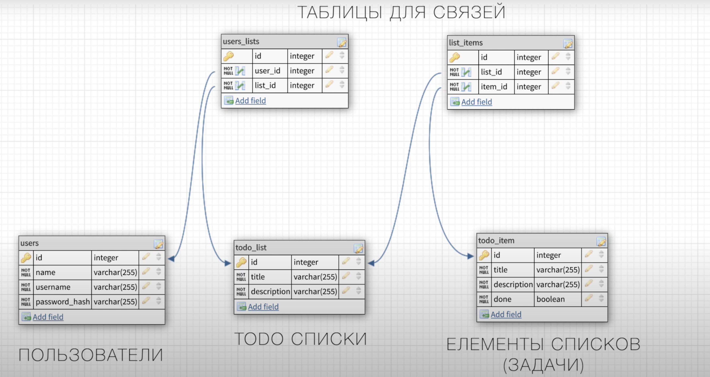

> ###### Проект находится в разработке
# 🔥 REST API для приложения организации списка дел и повышения продуктивности на GO

## В проекте применены следующие концепции:
- Разработка Веб-Приложений на Go, следуя дизайну REST API.
- Работа с фреймворком <a href="https://github.com/gin-gonic/gin">gin-gonic/gin</a>.
- Подход Чистой Архитектуры в построении структуры приложения. Техника внедрения зависимости.
- Работа с БД Postgres. Запуск из Docker. Генерация файлов миграций.
- Конфигурация приложения с помощью библиотеки <a href="https://github.com/spf13/viper">spf13/viper</a>. Работа с переменными окружения.
- Работа с БД, используя библиотеку <a href="https://github.com/jmoiron/sqlx">sqlx</a>.
- Регистрация и аутентификация. Работа с JWT. Middleware.
- Написание SQL запросов.
- Graceful Shutdown

### Архитектура моделей:



### Для запуска приложения:

```
make build && make run
```

Если приложение запускается впервые, необходимо применить миграции к базе данных:

```
make migrate
```